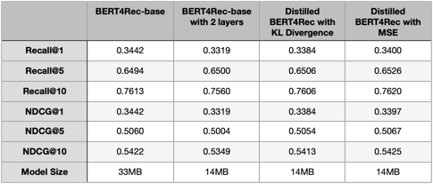

# Applying Knowledge Distillation on Bert4Rec

## How to Run
1. `pip3 install -r requirements.txt`
2. Change `templates.py` for parameter settings
3. Run `python3 main.py --template train_bert` to train the teacher model
4. Run `python3 main.py --template train_bert --mode distill`

## Result

- - -  
## Reference
* [BERT4Rec-PyTorch](https://github.com/SungMinCho/BERT4Rec-PyTorch)
* [distill-bert](https://github.com/kevinmtian/distill-bert)
